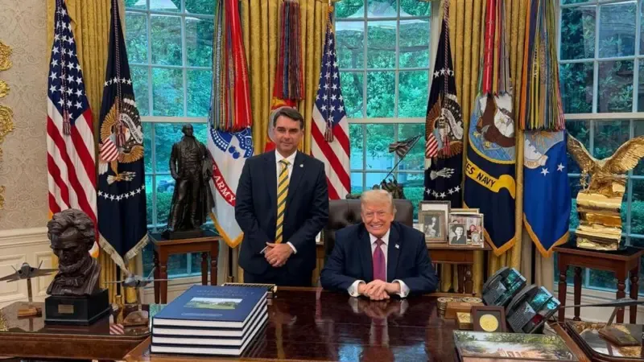

+++
title = "Tarifaço do Trump: Entreguismo e Imperialismo"
template = "post.html"
description = "Análise dos fatos relacionados ao entreguimo de Flavio Bolsonaro e as tarifas de Trump."
date="2026-08-12"
[extra]
date_in_portuguese="12 de agosto de 2026"
author="Lucash e Bebel Ecologia"
tags=["Geopolítica"]
lead = "Todos devem estar sabendo a respeito da tarifa que o Trump aplicou ao Brasil recentemente (02/06). Abaixo, analisaremos os fatos que levaram a essa nova tarifa."
+++

<figure class="flow">
<picture>
  
</picture>
<figcaption>
Foto: FlavioBolsonaro / instagram 
</figcaption>
</figure>

## 💸 O Tarifaço

Com um objetivo de expor o histórico sobre as tarifas do Trump, veremos que:

* Em 2018 Trump já começava a impor algumas tarifas sobre aço e alumínio, baixas a princípio, com o objetivo de “proteger” a produção estadunidense;
* Já em seu segundo mandato, em 2025, Trump começou a taxar Deus e o mundo, e começou impondo uma tarifa de 10% sobre todas as importações até uma lista extensa de taxas diferenciadas para vários países, o que ele mesmo chamou de “Tarifas Recíprocas”.

<aside>

> *Fato interessante: Alguns dos lugares taxados foram as ilhas Heard e McDonald, ilhas isoladas que são populadas somente por animais. 🐧*

</aside>

Em fevereiro de 2026, as tarifas recíprocas foram derrubadas pela Suprema Corte dos EUA decidindo que, apesar do presidente ter o direito de criar tarifas emergenciais, Trump deveria ter a autorização do Congresso para fazê-lo.

<aside>

> *Disclaimer sobre o imposto de importação no Brasil: Diferente de como é nos EUA, no Brasil nós temos um imposto próprio para importações, distinto de taxas ou tarifas, o que significa que ele possui previsão constitucional. E a alíquota desse imposto é definida livremente pelo presidente da república, respeitando tratados e acordos internacionais.*
> 

</aside>

Abordaremos a taxa atual mais à frente.

## 🙇‍♂️🍊 A empreitada de Flávio “B.”

Lembremo-nos do discurso do Flávio Bolsonaro no CPAC sobre a entrega das terras raras à mineradoras norte-americanas em março de 2026. Nessa ocasião, ele abertamente fez a defesa da a exploração e utilização dos nossos minerais no desenvolvimento de tecnologias do exército ~~fascista~~ dos EUA.

Recentemente, em junho de 2026, Flávio Bolsonaro foi para os EUA para se encontrar com Trump e tentar convencê-lo a classificar o PCC e o CV como organizações terroristas.

E isso não foi por acaso:

Em janeiro de 2026, nosso país vizinho, a Venezuela, foi invadido e teve seu presidente, Maduro, sequestrado pouco tempo após um anúncio dos EUA inventando uma organização de narcotráfico chamada “*Cartel de los Soles*” e classificando-a como terrorista.

Flávio Bolsonaro **sabe** o que significa e quais são as consequências de ter uma organização criminosa classificada como terrorista pelos EUA. Sabe os riscos de ter a mira dos EUA sobre nossos ombros.

E em resposta à visita de Flávio Bolsonaro (ou não), Trump classificou ambas as organizações criminosas como terroristas. E nós sabemos o que isso quer dizer: o objetivo final dessa empreitada é a entrega completa do Brasil aos EUA e demonstrar sua total subserviência ao governo norte-americano.

## 💸🫠 A nova tarifa do Trump

Logo após o encontro de Flávio Bolsonaro e Trump, o laranja propôs nova taxa de 25% sobre produtos brasileiros importados para os EUA com a desculpa de que o Brasil vem adotando “práticas que ‘oneram ou restringem’ o comércio com os norte-americanos”.

Apesar da investigação ter apontado práticas como pirataria e falta de combate a corrupção, não é muito difícil ligar os pontos para perceber que esse é um claro ataque à soberania do Brasil, principalmente ao PIX, já que se trata da maior derrota do Lobby norte-americano até aqui.

A taxa foi proposta pelo escritório de representação comercial dos EUA, baseando a justificativa em uma legislação estadunidense. Trata-se de um instrumento de política externa que permite ao governo norte-americano conduzir investigações sobre práticas comerciais estrangeiras consideradas "injustas ou discriminatórias”: a Seção 301 da Lei de Comércio de 1974 dos EUA, que não entra nas regras julgadas pela Suprema Corte dos EUA no início desse ano.

Obviamente, toda essa situação não pegou bem eleitoralmente ao Flávio Bolsonaro, portanto ele logo tirou o corpo fora ao pedir para Trump que os produtos brasileiros não fossem taxados.

Mas isso não isentou o entreguista de sugerir que o Brasil abandonasse o PIX para que seja implementado o Zelle, sistema privado dos EUA que é uma pior alternativa comparado ao PIX: é privado, pertence a bancos estadunidenses, não é instantâneo, não tem integração com o Banco Central e alguns bancos cobram taxas por transferência. 

## 🌎 Imperialismo, Estágio Superior do Capitalismo

**Veja também:** [Glossário Marxista-Leninista — Imperialismo](https://www.youtube.com/watch?v=ocHvPU27E4A&t=8091s)

Lenin nos traz em sua obra [O Imperialismo, Fase Superior do Capitalismo](https://www.marxists.org/portugues/lenin/1916/imperialismo/) a forma principal como o capital se utiliza de mecanismos de exploração internacionais para extrair capital dos países chamados de subdesenvolvidos ou “países em desenvolvimento”.

Não é novidade que o sistema dólar está ruindo no mundo inteiro e revelando a farsa da “superioridade” norte-americana. E acuado como está, os EUA não veem outra chance a não ser dobrar a aposta e partir para estratégias fascistas.

A queda do sistema dólar vem se tornando possível por causa da perda crescente de mercado global e hegemonia econômica geradas pelo crescimento da China e de alianças econômicas que buscam contornar a participação dos EUA e da sua moeda na circulação econômica entre países, como é o caso dos BRICS.

No livro de Lenin, é exposto como se formam os monopólios que se utilizam e que se infiltram nos países para a livre extração de recursos naturais e capital. Um dos exemplos mais claros disso são as privatizações nos serviços de energia com a Enel, empresa italiana que não contribui em nada com a economia brasileira.

A oferta de Flávio Bolsonaro de entregar nossas terras raras aos EUA é a expressão clássica do imperialismo rentista e parasitário: o capital financeiro norte-americano quer extrair nossos recursos sem pagar preço competitivo de mercado. Flávio Bolsonaro atua como intermediário da burguesia rentista que se submete ao capital estrangeiro (fenômeno que Lenin analisou nos países semicoloniais).

No que tange ao controle de nossos recursos naturais, é esclarecedor o surgimento de noticias como a proposta da criação da TerraBras, uma estatal que seria responsável pela pesquisa e industrialização das terras raras brasileiras, que acabou sendo rejeitada pelo governo.

O novo tarifaço cumpre outro papel crucial: foca nas indústrias e não no setor agrícola. Isso enfraquece a produção industrial nacional que, ao crescer e se desenvolver, poderia representar alguma competitividade ou resistência à hegemonia que os EUA ainda acreditam ter. Além disso, corrobora com a lógica de manter o Brasil no papel de celeiro do mundo, uma vez que a produção e vendas do agronegócio se mantêm a todo vapor.

E fica mais evidente o entreguismo vil de Flávio Bolsonaro ao sugerir que organizações criminosas brasileiras sejam classificadas como grupos “terroristas”. Dá aos EUA o direito (na sua visão) de intervir militarmente, sequestrar líderes (como Maduro) ou impor sanções. O pedido de Flávio Bolsonaro, sabendo disso, é um ato de subserviência colonial. Ele facilita que o capital norte-americano ganhe o direito de violar a soberania brasileira e manter o país em seu lugar na divisão internacional do trabalho.

Por outro lado, a nova tarifa proposta pelo governo norte-americano segue os mesmos preceitos apresentados por Lenin ao fazer clara ameaça à soberania brasileira, não só sugerindo o controle dos nossos recursos naturais, mas também o controle dos nosso sistema financeiro.

Por um motivo muito menor (não a ameaça do avanço socialista, mas um mero sistema de pagamentos que ameaça a hegemonia econômica dos bancos estadunidenses), é possível que passemos a sofrer embargos como os destinados a Cuba, Coreia Popular, Vietnã e Laos. Essa é mais uma das formas de manter os países do sul global em seu estado de impossibilidade de soberania através do controle da economia mundial. Esse tipo de ameaça é reiterado pelas instituições globais de diplomacia e crédito, a mando dos poderosos. Há apenas um caminho para enfrentar esses ataques: a organização da nossa classe, aqui e em qualquer lugar do mundo, para a conquista de um Estado proletário, uma luta pela soberania verdadeira, o enfrentamento aos poderosos e parasitas do Norte.

<section class="ending-card ">
    <h2>📕 Bibliografia</h2>
    <ul class="flow">
      <li>Vladímir Ilitch Lênin. <a href="https://www.marxists.org/portugues/lenin/1916/imperialismo/" target="_blank"><i>O Imperialismo, Fase Superior do Capitalismo.</i></a> Marxists.</li>
    </ul>
  </section>
  <section class="ending-card ">
    <h2>🔗 Fontes</h2>
    <ul class="flow">
      <li><a href="https://agenciabrasil.ebc.com.br/internacional/noticia/2018-03/trump-oficializa-tarifas-de-25-para-importacoes-de-aco-e-10-para-o" target="_blank"><i>Trump oficializa tarifas dos EUA para importações de aço e de alumínio</i></a> Agência Brasil.</li>
      <li><a href="https://g1.globo.com/economia/noticia/2025/04/02/tarifas-reciprocas-veja-a-lista-de-taxas-cobradas-pelos-eua-por-pais.ghtml" target="_blank"><i>Tarifas recíprocas: veja a lista completa de taxas cobradas pelos EUA por país</i></a> G1.</li>
      <li><a href="https://g1.globo.com/economia/noticia/2026/02/20/suprema-corte-dos-eua-trump-tarifas-globais.ghtml#2" target="_blank"><i>Suprema Corte dos EUA derruba tarifaço imposto por Trump</i></a> G1.</li>
      <li><a href="https://www.cnnbrasil.com.br/politica/flavio-diz-que-brasil-e-solucao-para-eua-ter-minerais-de-terras-raras/" target="_blank"><i>Flávio diz que Brasil é "solução para EUA ter minerais de terras raras"</i></a> CNN.</li>
      <li><a href="https://g1.globo.com/mundo/noticia/2026/05/27/flavio-bolsonaro-se-encontra-com-marco-rubio.ghtml" target="_blank"><i>Flávio Bolsonaro se encontra com vice de Trump e secretário de Estado dos EUA</i></a> G1.</li>
      <li><a href="https://apublica.org/2026/01/cartel-de-los-soles-como-eua-inventaram-para-atacar-venezuela/" target="_blank"><i>Como os EUA inventaram um cartel que não existe para justificar ação militar contra Maduro</i></a> Agência Pública.</li>
      <li><a href="https://www.cnnbrasil.com.br/internacional/sobre-pcc-e-cv-porta-voz-dos-eua-diz-que-trump-quer-eliminar-grupos/" target="_blank"><i>Sobre PCC e CV, porta-voz dos EUA diz que Trump quer eliminar grupos</i></a> CNN.</li>
      <li><a href="https://g1.globo.com/economia/noticia/2026/06/02/eua-concluem-investigacao-e-propoem-retaliacao-comercial-contra-o-brasil-por-decisoes-judiciais-tarifas-e-desmatamento.ghtml" target="_blank"><i>EUA concluem que Brasil tem práticas 'irrazoáveis' e propõem tarifa de 25% sobre produtos nacionais</i></a> G1.</li>
      <li><a href="https://g1.globo.com/politica/eleicoes/2026/noticia/2026/06/02/flavio-bolsonaro-tarifas.ghtml" target="_blank"><i>Flávio Bolsonaro diz ter pedido a Trump que não taxasse produtos do Brasil</i></a> G1.</li>
      <li><a href="https://oglobo.globo.com/blogs/sonar-a-escuta-das-redes/post/2026/06/eduardo-bolsonaro-sugere-troca-do-pix-por-sistema-americano-zelle-e-vira-alvo-de-criticas-nas-redes.ghtml" target="_blank"><i>Eduardo Bolsonaro sugere troca do Pix por sistema americano Zelle, e vira alvo de críticas nas redes: 'Vassalagem’</i></a> O Globo.</li>
    </ul>
  </section>
  <section class="ending-card ">
    <h2>🚩 Relacionado</h2>
    <ul class="flow">
      <li><a href="https://www.youtube.com/watch?v=a2DL8c86_ZY" target="_blank"><i>Trump quer classificar PCC e CV como terroristas.</i></a> Ian Neves.</li>
      <li><a href="https://www.youtube.com/watch?v=OXXl0nhUjbs" target="_blank"><i>Levantando a capivara de Flávio B(olsonaro).</i></a> Ian Neves.</li>
      <li><a href="https://www.youtube.com/watch?v=fAawBYzqyN4" target="_blank"><i>Átila explica porque Trump odeia o PIX</i></a> Tecnologia e Classe (TeClas).</li>
      <li><a href="https://www.youtube.com/watch?v=s6lJFbo1wVM" target="_blank"><i>A exploração de terras raras no Brasil</i></a> TeClas.</li>
      <li><a href="https://www.instagram.com/reel/DZXszOHRyLT/" target="_blank"><i>Em 1988, era a indústria nacional de informática. Em 2026, é o Pix.</i></a> Dudabolche.</li>
    </ul>
  </section>
  

