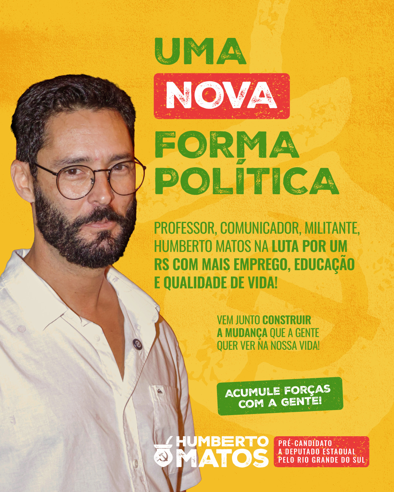

+++
title = "Voto útil, comunistas nas eleições e como sustentar a nossa posição"
template = "post.html"
description = ""
date = "2026-10-09"
[extra]
date_in_portuguese = "9 de outubro de 2026"
author = "Lucas Zawacki, Bebel Ecologia"
tags=["Análise", "Eleições"]
lead = ""
+++

# As enrascadas do voto útil: as decisivas eleições de 2026

No Brasil, todo período eleitoral é um momento de grande comoção para aqueles que “estão envolvidos com a política”. É um ano onde as discussões são acaloradas, os ciclos de notícias e as polêmicas envolvendo figuras da esfera política partidária são intensas. Além disso é um dos poucos momentos em nosso sistema de governo onde a classe trabalhadora é convidada a se posicionar e exercer o seu “papel democrático”, embora de maneira muito tímida. Durante o ano eleitoral e principalmente nos meses e semanas finais do processo o “falar sobre política” não é um tabu e os candidatos e partidos invadem nossos espaços públicos, mídias e redes sociais com seus panfletos, jingles e palavras de ordem.

Esta maior abertura para o falar de “política” é um dos motivos pelos quais este é um período importante também para os marxistas-leninistas, mas não pelos motivos que se imagina.

Como marxistas, nós acreditamos que a revolução é o único caminho para a emancipação da classe trabalhadora. Como marxistas, não acreditamos que a revolução virá pela eleição de comunistas o suficiente para o parlamento ou cargos executivos. Ao mesmo tempo, entendemos que a campanha política e o voto fazem sentido como parte de uma tática de elevação da consciência e da organização da classe trabalhadora, como discutido em [‘É comunista e disputa as eleições?’](https://soberana.tv/portal/e-comunista-e-disputa-eleicoes/) .

Em resumo, a campanha e eventual eleição de candidatos de um partido comunista deve ser um instrumento para o crescimento das fileiras do partido, discussão do programa comunista e aproximação com a classe trabalhadora. E mais do que isso: **deve esclarecer a luta de classes como o campo de todas nossas batalhas**. O teatro que acontece no plenário é apenas uma sombra distorcida da política real que é movida pelo conflito entre aqueles que trabalham e aqueles que, por dominarem os meios de produção, exploram o trabalho alheio. Qualquer saldo de um pleito eleitoral que não avance nesse sentido deve ser posto em dúvida.

Mas dependendo da sua inclinação política, provavelmente à esquerda, já que está lendo o Órgão Central de um coletivo comunista, isso tudo deve estar soando um pouco desconfortável. Afinal **essa eleição é vital para sobrevivência do nosso movimento no Brasil**. Estamos vendo claras articulações golpistas vindo dos EUA e temos uma eleição presidencial onde um novo Bolsonaro, ainda que com menos carisma e mais miliciano, consegue intenções de votos suficientes para ser o segundo lugar atrás do maior líder popular que este país já teve. Mesmo com o Lula mais ao centro que já tivemos, mesmo após um governo Lula 3 que conseguiu conciliar PT e PSDB e não reverteu reveses imensos do período Temer e Bolsonaro, como a reforma trabalhista e a reforma do Novo Ensino Médio. Nada disso desacelerou a sanha golpista da direita e dos EUA que se mostra cada vez mais escancarada.[1][2][3][4]

## “Se Flávio Bolsonaro vencer essas eleições, o que será do movimento comunista?”

Uma vitória do Flávio significa um recrudescimento da violência contra as organizações comunistas e uma união do Brasil às operações estadunidenses na América Latina. O que pode tomar a forma de integração do Brasil ao programa ‘Escudo das Américas’, a caracterização de grupos criminosos (e depois de grupos ativistas) como terroristas, o entreguismo de nossos recursos naturais, parcerias entre nossa polícia e militares com forças dos EUA e até invasões mais diretas ao nosso território. Isso sem falar nas ameaças para o povo que as políticas domésticas de um governo “Bolsonaro II” representam.

Entretanto, uma vitória de Lula seja em primeiro, seja em segundo turno, não significa proteção. A esta altura, além das ameaças de golpe estarem cada vez mais sólidas, o próprio governo Lula não se mostra disposto a enfrentar as forças do capital estadunidense. Seu enfrentamento é silencioso, não convoca as multidões que o apoiam, não aproveita de seu capital político para fazer política de ruas e intimidar o imperialismo. Isso significa, na prática, que **nenhum desses dois resultados eleitorais garantem segurança para nosso movimento**.

Nesse ritmo estamos a entregar cada vez mais trabalhadores na mão da extrema-direita. Tanto pelos fracassos da social-democracia em atender os anseios do povo, quanto pela sua derrota em seu próprio jogo: o de fortalecer figuras com amplo trabalho de base para angariar capital político. Para onde vai a esquerda após o Lula? Essa resposta não está nada clara.

Entretanto, não precisa ser assim: hoje se abre uma porta para que a esquerda revolucionária ganhe espaço. Nesse sentido, o voto ideológico tem um papel sobre o qual discorreremos a seguir, mas a nossa única arma segue sendo a militância organizada, o serviço do militante a todos os trabalhadores para fortalecer e oferecer o programa socialista ao país inteiro.

## O voto ideológico é o voto da pressa!

Uma parcela cada vez maior de eleitores se recusa a comparecer nas urnas e dar seu voto à política burguesa. A decepção não vem do nada: nossos políticos, da direita à esquerda do espectro político, só lembram dos interesses da população quando chegam as eleições. Candidaturas menores, combativas e ligadas às pautas e movimentos da classe trabalhadora tem uma dificuldade imensa de sequer aparecer como parte da disputa.  Dessa forma, apenas a massificação (ainda que vagarosa) dos votos nas alternativas revolucionárias poderá apresentar essas candidaturas como viáveis e dar voz a programas verdadeiramente populares. O voto ideológico, portanto, é um meio para agitarmos e demonstramos apoio às nossas bandeiras.

Hoje, muitas pessoas medem sucesso de movimentos comunistas olhando para os votos que somam a cada período eleitoral. A métrica é muito infeliz: desconsidera a conjuntura não só eleitoral, mas sindical, partidária, entre outras. Mas, temos que admitir, ainda é um dado público e que comunica com a maioria da população. É necessário, portanto, utilizar esse dado a nosso favor como for possível, na comunicação também. Um aumento de votos nas candidaturas comunistas sinaliza para nossa população que algo está emergindo. E esse algo, para alguns, vai merecer atenção. Para além disso, o volume de votos serve de barganha no momento do segundo turno: exigências podem ser colocadas em troca do apoio da militância, a depender do resultado do trabalho do partido no primeiro turno.

Portanto os críticos ao voto ideológico estão completamente equivocados em suas táticas, mas como poderiam acertar? Seus posicionamentos não partem do debate coletivo construído sob uma organização de classe, há apenas o medo e o formato cômodo de levar a cabo a disputa eleitoral. Naturalmente, deveriam começar seus esforços convencendo os indecisos e debatendo com os milhões que se recusam a votar, além das pessoas iludidas pelas mentiras da direita, em lugar de disputar os votos que vão para o lugar correto, que movimentam as convicções dessa parcela do povo, e que apontam para o único caminho correto - em especial se quem está pregando esse voto na social-democracia é alguém que se entende por comunista.

Afinal, alguém que se entende por comunista mas não está organizado e, no período eleitoral, faz campanha ativa pelo “voto útil” está, na prática, construindo o projeto da social-democracia de cabo a rabo: **deixando de construir a alternativa e oferecendo seu voto ao projeto burguês**.

O “voto crítico”, para a urna, é igual a qualquer outro voto. Ele ser crítico não o torna menos válido do que um voto acrítico. O que realmente pode afetar a correlação de forças, mesmo assumindo um segundo turno em apoio à social-democracia, é o volume de votos nas candidaturas que podem tensionar mais à esquerda: as candidaturas revolucionárias.

## 2026: a pista tá salgada

Nesta eleição tem um espectro diferente que ronda. Tendo participado de dois outros pleitos pregressos fazendo explicitamente o trabalho de agitação e propaganda comunista na internet, já vimos toda sorte de críticas ao tão mal falado “webcomunismo”.

Mal falado por quem? Por todos aqueles que não concordam com a nossa leitura sobre eleições e, mais importante, não acreditam na revolução como o verdadeiro caminho para a mudança social: social-democratas, “sociais” liberais, trabalhistas, todo tipo de reformistas e principalmente aqueles que lembram que existe política somente durante as eleições.

A nossa experiência nos períodos eleitorais é a de sermos acusados de irrelevantes (”não enchem uma kombi” e etc…) e ao mesmo tempo responsáveis por trabalhar gratuitamente na divulgação de qualquer candidato que colocou o pé à esquerda de Bolsonaro. Sob pena de então sermos os culpados pela “derrota da esquerda” quando ela inevitavelmente acontece.

Mas o que está diferente agora? Estamos passando por um período eleitoral extremamente polarizado no qual virtualmente não estão acontecendo debates, boicotados por Lula e Flávio Bolsonaro. As candidaturas menores, incluindo as do campo comunista, se encontram muito enfraquecidas e em grande parte ignoradas. Isso tem um outro resultado que é uma notável redução dos ataques que os comunistas recebem nesse período eleitoral. Porém, eles ainda existem e têm um perfil diferente.

Dessa vez, os ataques vêm dos outros comunistas que supostamente entendem melhor do que todos os outros qual é a tática correta para as eleições: se eleger junto aos partidos burgueses. É claro, com as melhores ideias e as mais profissionais e bem financiadas campanhas. Campanhas que despendem milhões em materiais, produção, viagens, mas sem um centavo sequer chegando aos movimentos de massas e engrossando suas fileiras (como criticamos na candidatura do Boulos em São Paulo, em 2024[5]). E engrossar as fileiras dos movimentos é algo que, nos partidos marxistas-leninistas, se mistura com a campanha: panfletagens e ofertas dos jornais das organizações se transformam em conversas, contatos, articulações **que se intensificam durante a campanha mas perduram para além do voto.**

Pouco a pouco, as alianças com partidos da ordem mostram a que vieram: candidatos antes militantes, como Jones Manoel ou Humberto Matos, terminaram abandonando suas vanguardas para dar foco absoluto ao processo eleitoral (uma das atitudes mais antileninistas imagináveis). A Bancada da Esquerda Radical aceitou agregar figuras como Heloísa Helena, uma mulher que assinou o PL sionista da Tabata Amaral e que se posiciona contra a legalização do aborto, e tudo isso em meio a uma figura central na internet (Jones Manoel) que passou a maior parte de sua pré-campanha e campanha criticando todos os partidos revolucionários em toda oportunidade que aparecia, deturpando o significado leninista de “amadorismo” (que não tem relação com processos eleitorais, mas com trabalho de massas, que nenhum destes candidatos realiza). O PCdoB já se tornou um reboque do PT há tantos anos que chega a ser cômico o fingimento desta ser uma organização marxista até hoje. Nem mesmo Elias Jabbour tem feito questão de usar a alcunha de comunista. O “nacional-desenvolvimentismo”, que tem aromas em tantas dessas personalidades masculinas que hoje se candidatam, já tomou conta. O partido defende o governo petista da “oposição” à esquerda há tanto tempo que é fácil deduzir que um processo revolucionário durante um governo petista teria que enfrentar a oposição do PCdoB.

Temos, diante de nós, casos patentes de oportunismo. Mais textos virão explorando esse conceito, mas por hoje, a terminologia comunista utilizada por essas figuras tem servido para mistificar suas campanhas e confundir os que se identificam: comitê central, poder popular, militância, amadorismo, tarefas e etc… Todos termos empregados em campanhas, mas não em militância ativa e cotidiana, com vanguarda e programa partidário. Todas estão apenas orientadas a eleger figuras influentes, em especial influentes nas redes.

Todos os partidos comunistas entendem as vantagens de eleger seus quadros. Os benefícios são sedutores. A verba de gabinete e o salário são suficientes para fortalecer muito os movimentos e militantes dos partidos pequenos e boicotados dessa falsa democracia. A ideia de que terão uma cadeira cativa no parlamento que será usada para expor a luta de classes. Porém, apesar de valer muito esforço para ter uma eleição, não vale **tudo**. A deturpação da nossa teoria organizativa é um preço demasiado alto a se pagar por um cargo num parlamento burguês, que do dia pra noite pode ser cassado sem maiores justificativas. É por isso que estar em partidos da ordem ou em coligações duvidosas deveria ser mais que suficiente para preocupar os comunistas militantes, os que de fato enxergam um horizonte revolucionário. Não precisa ser radical para enxergar isso: o golpe da Dilma em 2016 já nos apresentou essa contradição de forma patente.

Porque realmente nessa eleição temos um fenômeno “novo”: os comunistas que trabalham para o “voto útil” ainda no primeiro turno. Que fazem as suas campanhas fora de qualquer organização partido (partido leninista!) e ressignificam trechos da nossa tradição para justificar táticas que já estavam falidas há 100 anos. Na intenção de “errar diferente”, estão apenas errando.

---

<aside>
🔗 **Fonte**

1. [https://www.metropoles.com/mundo/secom-ve-mencao-ao-stf-em-anuncio-de-zuckerberg-tribunais-secretos](https://www.metropoles.com/mundo/secom-ve-mencao-ao-stf-em-anuncio-de-zuckerberg-tribunais-secretos)
2. [https://g1.globo.com/mundo/noticia/2026/07/25/governo-trump-planeja-enviar-funcionarios-ao-brasil-para-questionar-integridade-das-urnas-eletronicas-diz-jornal.ghtml](https://g1.globo.com/mundo/noticia/2026/07/25/governo-trump-planeja-enviar-funcionarios-ao-brasil-para-questionar-integridade-das-urnas-eletronicas-diz-jornal.ghtml)
3. [https://g1.globo.com/mundo/noticia/2026/05/26/comitiva-de-flavio-bolsonaro-divulga-foto-do-senador-com-donald-trump.ghtml](https://g1.globo.com/mundo/noticia/2026/05/26/comitiva-de-flavio-bolsonaro-divulga-foto-do-senador-com-donald-trump.ghtml)
4. https://www.youtube.com/watch?v=G1scSxxsPQw
5. https://www.youtube.com/watch?v=PVvjQ78S0Hs
</aside>

<aside>
📕 **Bibliografia**

-
</aside>
